## LIRI Assignment

### Watch Video of the assignment as Performed by Me!!!

https://vimeo.com/353225387

At bottom are Images pertaining to the working assignment. 

### Overview

In this assignment, LIRI app is made to function much like SIRI. However, while SIRI is a Speech Interpretation and Recognition Interface, LIRI is a _Language_ Interpretation and Recognition Interface. LIRI will be a command line node app that takes in parameters and gives you back data.

### Instructions (Assignment as was given)

1. Navigate to the root of your project. Collect all packages needed for initializing this assignment.

2. Make a `.gitignore` will leave out the following from the github site.

* (therefore you will not see the following)
``` 
node_modules
.DS_Store
.env
```

3. Make a JavaScript file named `keys.js`.

* Inside keys.js you will attach .env and export the id and secret for spotify into liri.js

4. Next, create a file named `.env`, add the secret and the id

* This file will be used by the `dotenv` package to set what are known as environment variables to the global `process.env` object in node. These are values that are meant to be specific to the computer that node is running on, and since we are gitignoring this file, they won't be pushed to github &mdash; keeping our API key information private.

* If someone wanted to clone your app from github and run it themselves, they would need to supply their own `.env` file for it to work.

5. Make a file called `random.txt`.

   * Inside of `random.txt` put the following in with no extra characters or white space:

     * spotify-this-song,"I Want it That Way"

6. Make a JavaScript file named `liri.js`.

7. At the top of the `liri.js` file, add code to read and set any environment variables with the dotenv package:

```js
require("dotenv").config();
```

8. Add the code required to import the `keys.js` file and store it in a variable.

```js
  var keys = require("./keys.js");
```
  
* You should then be able to access your keys information like so

  ```js
  var spotify = new Spotify(keys.spotify);
  ```

9. Make it so liri.js can take in one of the following commands:

   * `concert-this`

   * `spotify-this-song`

   * `movie-this`

   * `do-what-it-says`

### What Each Command Should Do

1. `node liri.js concert-this <artist/band name here>`

   * This will search the Bands in Town Artist Events API for an artist and render the following information about each event to the terminal:

     * Name of the venue

     * Venue location

     * Date of the Event (use moment to format this as "MM/DD/YYYY")

2. `node liri.js spotify-this-song '<song name here>'`

   * This will show the following information about the song in your terminal/bash window

     * Artist(s)

     * The song's name

     * A preview link of the song from Spotify

     * The album that the song is from

   * If no song is provided then your program will default to "The Sign" by Ace of Base.

   * You will utilize the [node-spotify-api](https://www.npmjs.com/package/node-spotify-api) package in order to retrieve song information from the Spotify API.

   * The Spotify API requires you sign up as a developer to generate the necessary credentials. You can follow these steps in order to generate a **client id** and **client secret**:

   * Following are steps for running Spotify if wanting to attempt use in the future

   ** Step One: Visit <https://developer.spotify.com/my-applications/#!/>

   ** Step Two: Either login to your existing Spotify account or create a new one (a free account is fine) and log in.

   ** Step Three: Once logged in, navigate to <https://developer.spotify.com/my-applications/#!/applications/create> to register a new application to be used with the Spotify API. You can fill in whatever you'd like for these fields. When finished, click the "complete" button.

   * Step Four: On the next screen, scroll down to where you see your client id and client secret. Copy these values down somewhere, you'll need them to use the Spotify API and the [node-spotify-api package](https://www.npmjs.com/package/node-spotify-api).

3. `node liri.js movie-this '<movie name here>'`

   * This will output the following information to your terminal/bash window:

     ```
       * Title of the movie.
       * Year the movie came out.
       * IMDB Rating of the movie.
       * Rotten Tomatoes Rating of the movie.
       * Country where the movie was produced.
       * Language of the movie.
       * Plot of the movie.
       * Actors in the movie.
     ```

   * If the user doesn't type a movie in, the program will output data for the movie 'Mr. Nobody.'

     * If you haven't watched "Mr. Nobody," then you should: <http://www.imdb.com/title/tt0485947/>

     * It's on Netflix!

   * You'll use the `axios` package to retrieve data from the OMDB API. Like all of the in-class activities, the OMDB API requires an API key. You may use `trilogy`.

4. `node liri.js do-what-it-says`

   * Using the `fs` Node package, LIRI will take the text inside of random.txt and then use it to call one of LIRI's commands.

     * It should run `spotify-this-song` for "I Want it That Way," as follows the text in `random.txt`.

     * Edit the text in random.txt to test out the feature for movie-this and concert-this.


### WORKING ASSIGNMENT IMAGES

I've included a list of images that reflect the work that I've done for this program outside of my vimeo video which can be viewed at 
https://vimeo.com/353225387. 

# IMAGES BELOW OF ASSIGNMENT WORKING

* Switch Statement
This is my switch statement to show the exact commands for images: 
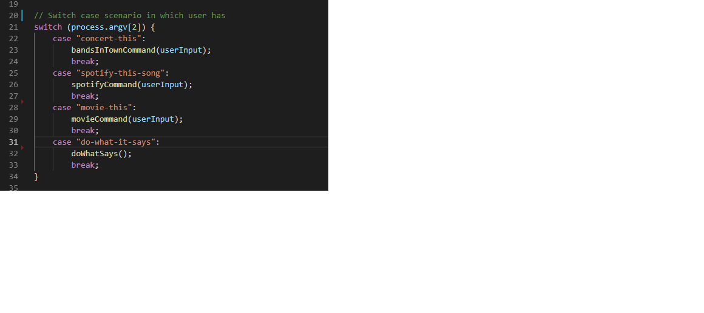

* Bands In Town
This is my bandsintown code. The red box highlights the artist if the user does not provide a specification/the specification is null. The blue box is where the console.log resides. Console.log outputs the code that the user will see in the terminal:

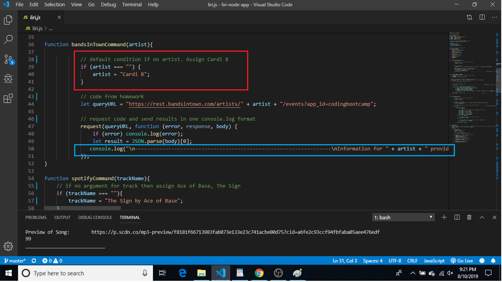

Running the command 'concert-this' to show that this application functions: 

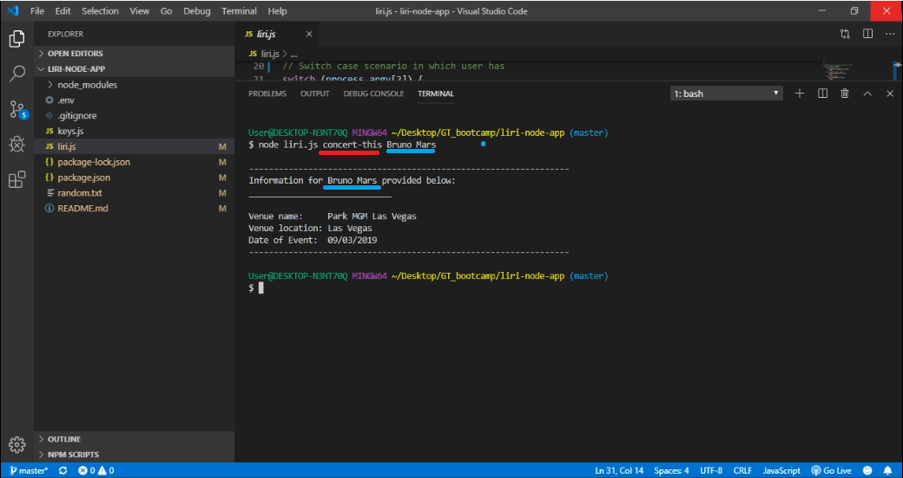

Running null case of 'concert-this' to show that this application functions despite no specifications:


* Spotify
This is my spotify code. The red box highlights the artist if the user does not provide a specification/the specification is null. The blue box is where the console.log resides. Console.log outputs the code that the user will see in the terminal:

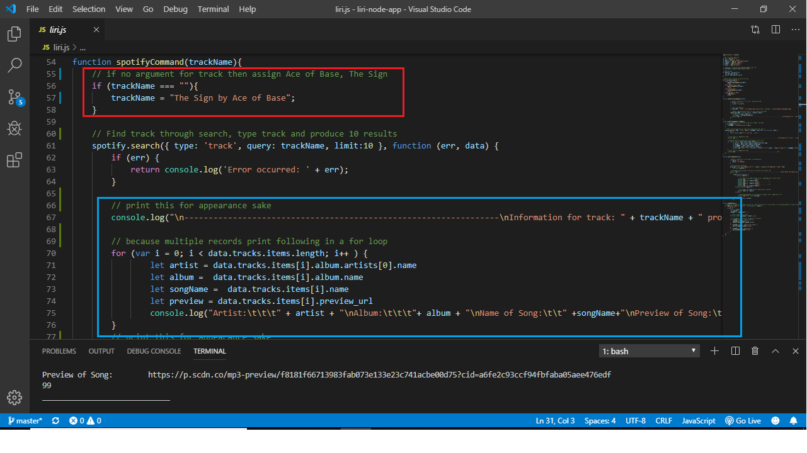

Running the command 'spotify-this-song' to show that this application functions: 

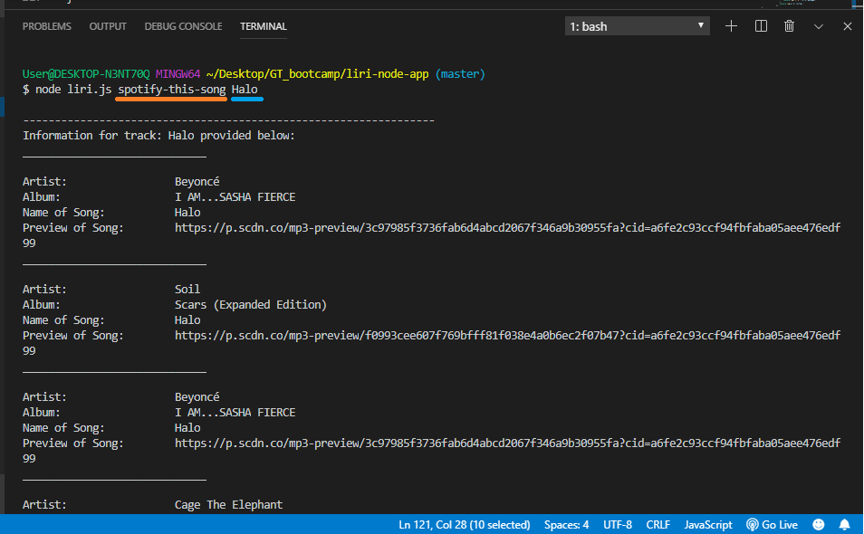

Running null case of 'spotify-this-song' to show that this application functions despite no specifications:

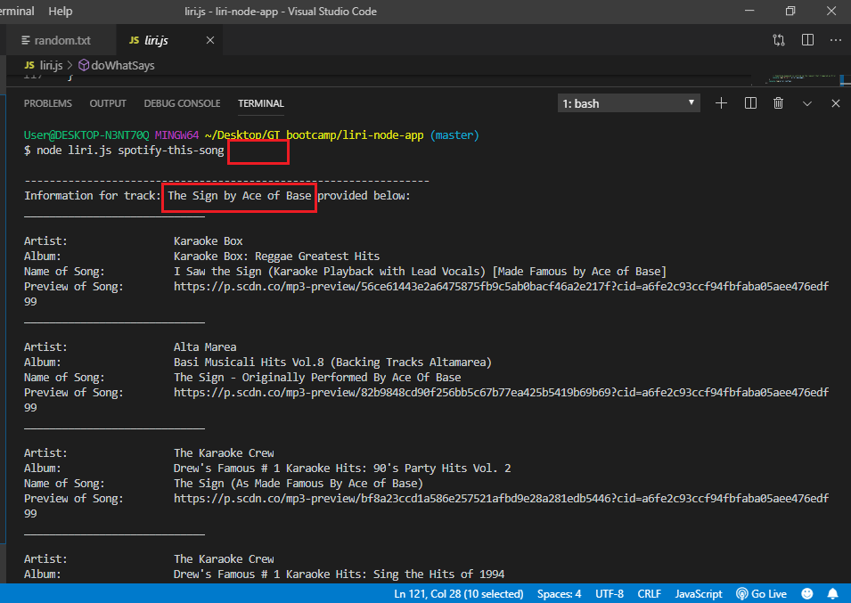

* OMBD or Movie code
This is my omdb code. The red box highlights the artist if the user does not provide a specification/the specification is null. The blue box is where the console.log resides. Console.log outputs the code that the user will see in the terminal:

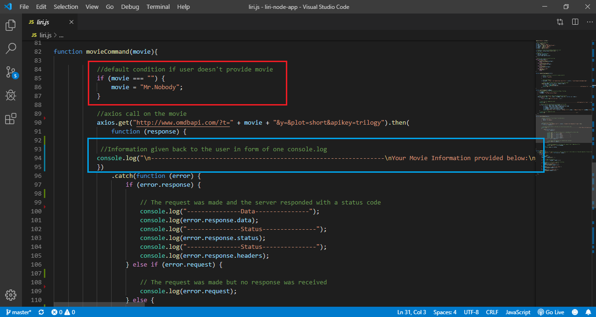

Running the command 'movie-this' to show that this application functions: 

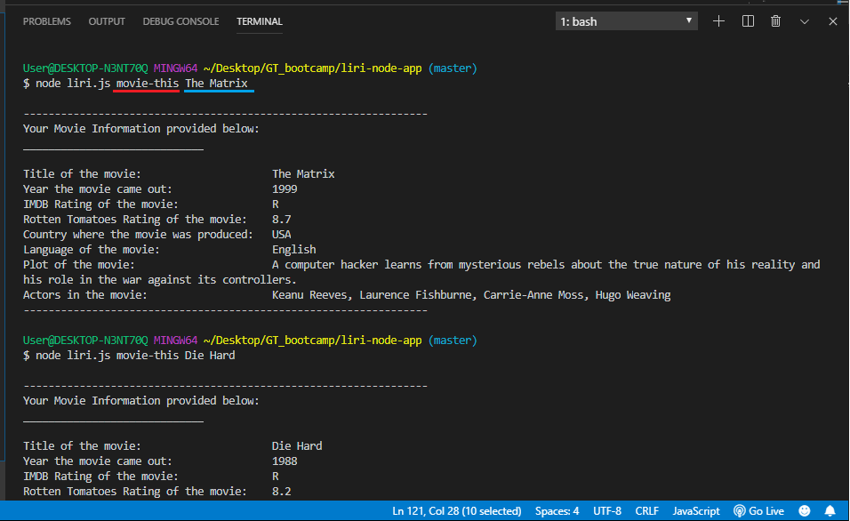

Running null case of 'movie-this' to show that this application functions despite no specifications:

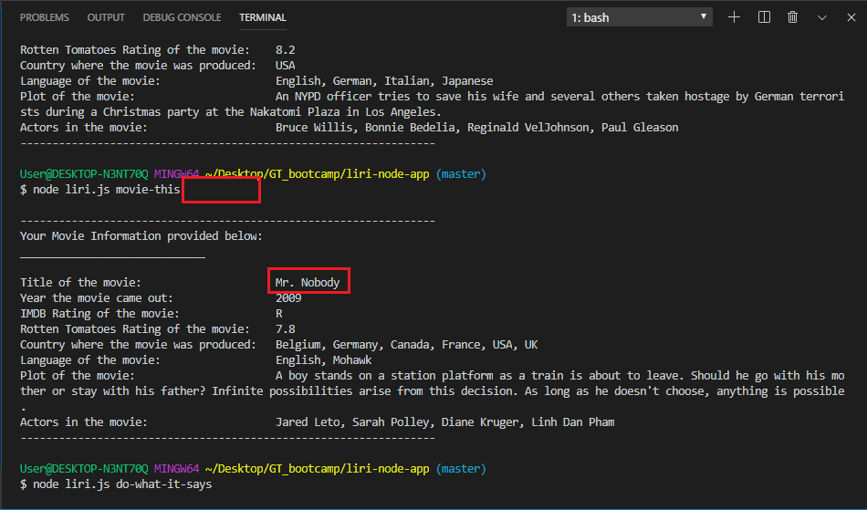

* Random.txt 
This is my Random.txt code. The red box highlights the artist if the user does not provide a specification/the specification is null. The blue box is where the console.log resides. Console.log outputs the code that the user will see in the terminal:

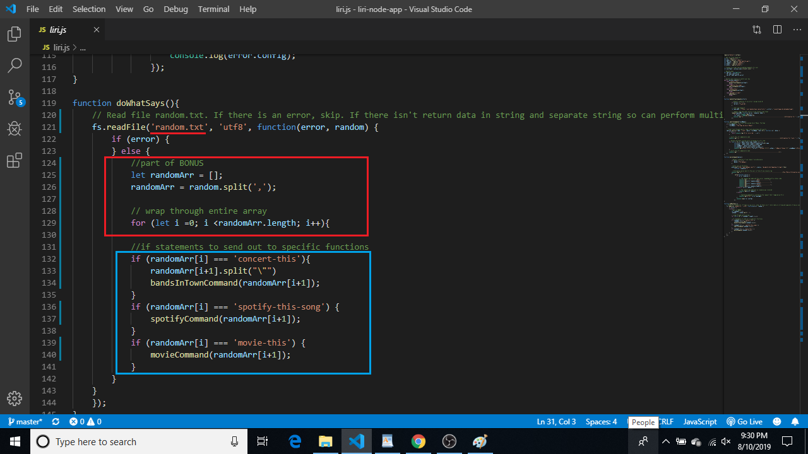

Showing you inside the random.txt file to have a better understanding of what this command will do: 

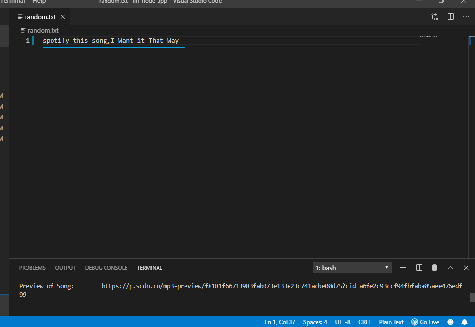

Running the 'do-what-it-says' command to show that this application functions based on the random.txt instructions:

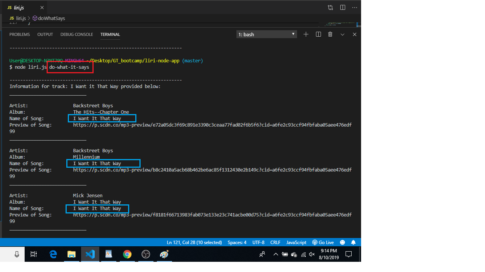

Also, in the video I added more to the random.txt file and ran the 'do-what-this-says' command. It will pull all information in random.txt and run. Please check out my video: https://vimeo.com/353225387 to see this in action!


